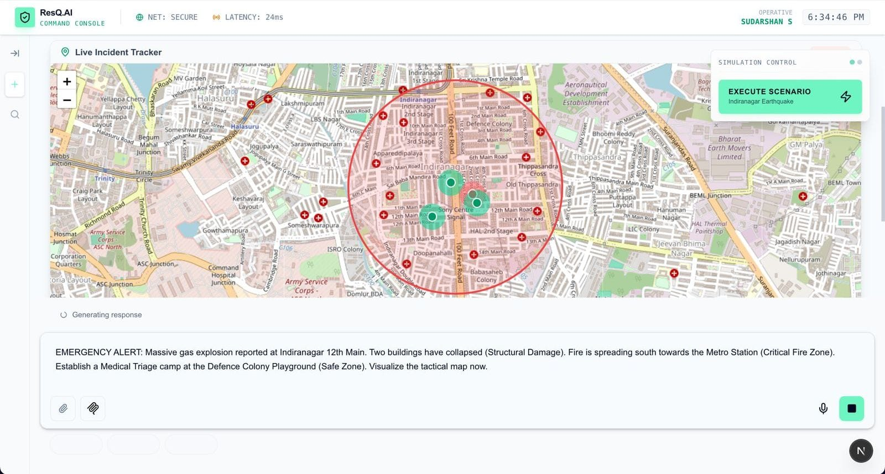
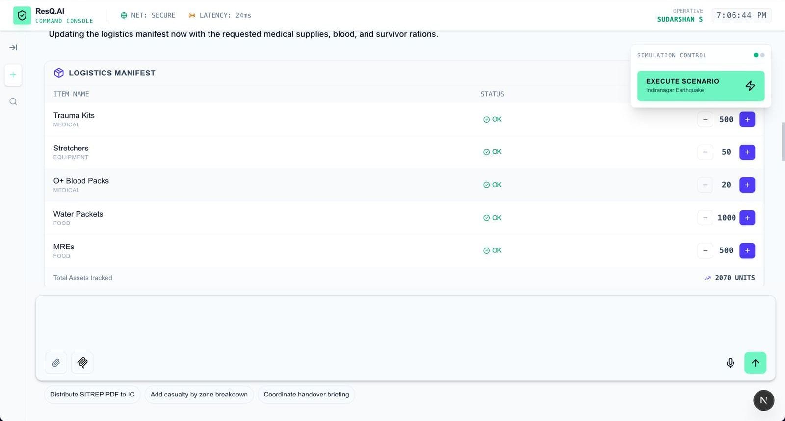
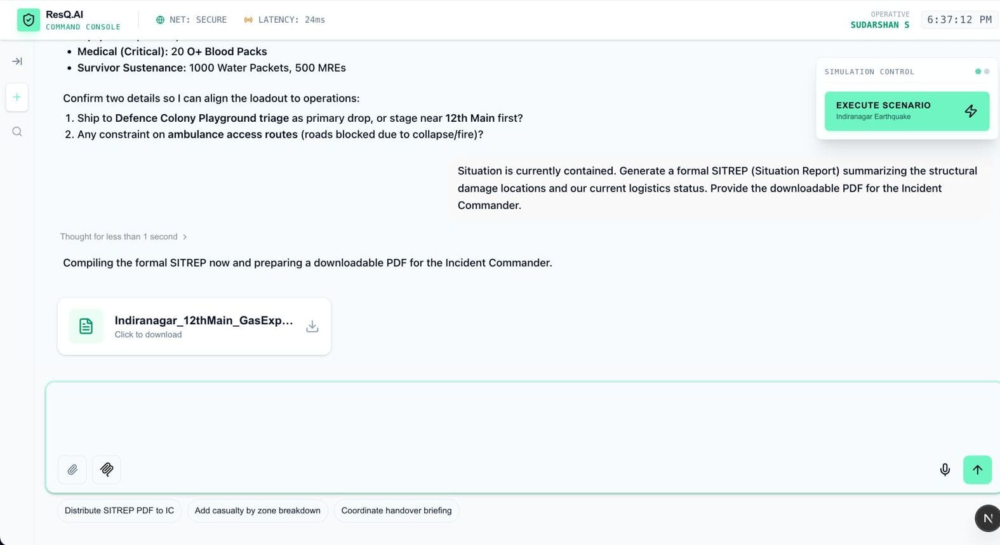

# ResQ-AI: Generative UI for Crisis Response

ResQ-AI is an intelligent crisis management platform that uses Generative AI to instantly render tactical user interfaces based on natural language commands. Instead of navigating complex dashboards, commanders simply describe the situation, and the system generates live maps, logistics inventories, and situation reports in real-time.


## Table of Contents

- [Live Demo](#live-demo)
- [Key Features](#key-features)
- [Technology Stack](#technology-stack)
- [Usage Guide & Demo Scenarios](#usage-guide--demo-scenarios)
  - [1. Generative Mapping](#1-generative-mapping)
  - [2. Auto-Logistics Inventory](#2-auto-logistics-inventory)
  - [3. SITREP Generation & PDF Export](#3-sitrep-generation--pdf-export)
- [Installation](#installation)
- [Configuration](#configuration)
- [License](#license)

## Live Demo

Access the live application here: [Insert Vercel Link Here]

## Key Features

1.  **Generative Tactical Mapping**: Instantly identifies locations, threat types (fire, structural, medical), and safe zones from text descriptions and renders them on an interactive Leaflet map.
2.  **Dynamic Inventory Management**: Automatically categorizes resources (medical, food, equipment) and flags critical shortages based on natural language inputs.
3.  **Automated Reporting**: Synthesizes all active data into a formal Situation Report (SITREP) and generates a downloadable PDF for official communication.

## Technology Stack

-   **Framework**: Next.js 15 (App Router)
-   **Styling**: Tailwind CSS (Custom Aquamarine Theme)
-   **AI Integration**: Tambo SDK (Generative UI)
-   **Maps**: React-Leaflet & OpenStreetMap
-   **State Management**: React Context API (CrisisContext)
-   **PDF Generation**: jsPDF & AutoTable
-   **Icons**: Lucide React

## Usage Guide & Demo Scenarios

Follow this step-by-step guide to demonstrate the capabilities of ResQ-AI.

### 1. Generative Mapping

The system extracts geospatial data and threat levels from your text.

**Scenario**: A structural collapse and fire in a dense urban area.

**Prompt to Enter:**
> EMERGENCY ALERT: Massive gas explosion reported at Indiranagar 12th Main. Two buildings have collapsed (Structural Damage). Fire is spreading south towards the Metro Station (Critical Fire Zone). Establish a Medical Triage camp at the Defence Colony Playground (Safe Zone). Visualize the tactical map now.

**Result**:
The system renders a map centered on Indiranagar.
-   **Red Markers**: Indicate Fire/Critical zones.
-   **Blue Markers**: Indicate Structural damage.
-   **Green Markers**: Indicate Safe/Medical zones.



### 2. Auto-Logistics Inventory

The system understands logistics, categorizes items, and highlights urgency.

**Scenario**: Mobilizing resources for the victims.

**Prompt to Enter:**
> Mobilize logistics immediately. We have 200 casualties. Dispatch 500 Trauma Kits and 50 Stretchers (Equipment). We urgently need 20 O+ Blood Packs (Critical). Also send 1000 Water Packets and 500 MREs for the survivors. Update the manifest.

**Result**:
A "Logistics Manifest" table appears.
-   **Medical**: Trauma Kits, Blood Packs.
-   **Food**: Water Packets, MREs.
-   **Equipment**: Stretchers.
-   **Critical Status**: The "Blood Packs" row is highlighted in red/bold to indicate critical urgency.



### 3. SITREP Generation & PDF Export

The system aggregates all session data into a formal report.

**Scenario**: Generating a handover report for headquarters.

**Prompt to Enter:**
> Situation is currently contained. Generate a formal SITREP (Situation Report) summarizing the structural damage locations and our current logistics status. Provide the downloadable PDF for the Incident Commander.

**Result**:
The system provides a text summary and renders a "Download SITREP" card. Clicking it downloads a PDF containing:
-   **Header**: Official Incident Report title and timestamp.
-   **Table 1**: Complete inventory list.
-   **Table 2**: List of all identified locations and their coordinates.



## Installation

To run this project locally:

1.  **Clone the repository:**
    ```bash
    git clone [https://github.com/YOUR_USERNAME/resq-ai.git](https://github.com/YOUR_USERNAME/resq-ai.git)
    cd resq-ai
    ```

2.  **Install dependencies:**
    ```bash
    npm install
    # or
    yarn install
    ```

3.  **Set up Environment Variables:**
    Create a `.env.local` file in the root directory and add your API keys:
    ```bash
    NEXT_PUBLIC_TAMBO_API_KEY=your_api_key_here
    NEXT_PUBLIC_TAMBO_URL=[https://api.tambo.ai/v1/chat](https://api.tambo.ai/v1/chat)
    ```

4.  **Run the development server:**
    ```bash
    npm run dev
    ```

5.  Open [http://localhost:3000](http://localhost:3000) in your browser.

## Configuration

The application uses a custom `CrisisContext` to manage state without a backend database for demonstration purposes. This ensures fast, reliable performance during live presentations.

-   **Map Configuration**: Default center is set to Bangalore (12.9716, 77.5946). This can be modified in `src/components/resq/DisasterMap.tsx`.
-   **Theme**: The visual theme is defined in `src/app/globals.css` using Tailwind CSS variables.

## License

This project is licensed under the MIT License - see the LICENSE file for details.